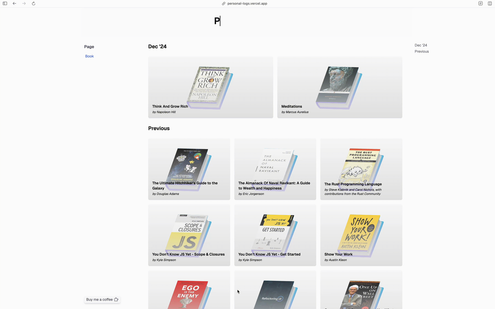

<div align="center">


# ✨ Personal Logs

Tracking books I've read and more. Browse around—you might find something interesting! ☕


</div>

## 🔌 Getting Started

1. Clone the repository on your local machine with the command below in your terminal, and cd into the **personal-logs** folder.

```shell
git clone https://github.com/hsnice16/personal-logs.git
cd personal-logs
```

2. Install dependencies (if you are using **yarn** then do with that).

```shell
npm install
```

3. Start the development server.

```shell
npm run dev
```

## 👀 How it looks



---

## 💚 Sponsor

If you found this project helpful, then do consider sponsoring it - [Sponsor](https://github.com/sponsors/hsnice16)<br/>And, give it a star 🌟
